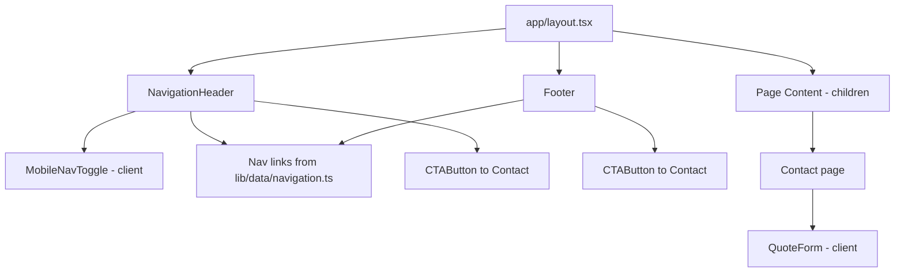

# Design Document

## Overview

Brightwell Floors is a static marketing website for a real wood flooring company, built with **Next.js (App Router, React)** and **Tailwind CSS**. The site educates visitors about wood flooring options, showcases past work, and drives conversions toward a free design consultation / quote request.

The site is composed of eight primary pages served through the Next.js App Router, all sharing a common layout (Navigation Header + Footer). Content is largely static and rendered at build time (Static Site Generation) for fast loads and strong SEO. The single interactive component with meaningful logic is the **Quote Form**, which performs client-side validation and manages submission state through a placeholder submit handler that can later be wired to a backend endpoint.

Design influence is drawn from the reference flooring site (modafloorsandinteriors.com) — a clean, image-forward, section-based marketing layout with persistent navigation and prominent CTAs — adapted to a premium wood-flooring aesthetic through a warm, natural color palette and refined typography.

### Design Goals

- **Conversion-focused**: Every content page carries at least one CTA linking to Contact.
- **Fast and SEO-friendly**: Static rendering, per-page metadata, semantic HTML.
- **Responsive**: Single-column mobile, tablet, and desktop layouts with no horizontal scroll at 320px+.
- **Accessible**: Keyboard navigable, visible focus, sufficient contrast, descriptive alt text.
- **Maintainable**: Content (species, business details, form schema) lives in typed data modules so placeholder values are easy to replace.

### Requirements Coverage Map

| Requirement | Covered By |
|-------------|-----------|
| 1. Navigation Header | `NavigationHeader` component, shared layout, mobile toggle |
| 2. Footer | `Footer` component, shared layout |
| 3. Home Page | `app/page.tsx`, `Hero`, `ValueProp`, `Highlights` sections |
| 4. About Page | `app/about/page.tsx` |
| 5. Flooring Types Page | `app/flooring-types/page.tsx` |
| 6. Styles/Options Page | `app/styles/page.tsx` |
| 7. Species Catalog | `app/species/page.tsx`, `SpeciesGrid`, species data module |
| 8. Gallery Page | `app/gallery/page.tsx`, `GalleryGrid` |
| 9. Services Page | `app/services/page.tsx` |
| 10. Contact / Quote Form | `app/contact/page.tsx`, `QuoteForm`, validation module |
| 11. Responsive Design | Tailwind breakpoints, layout primitives |
| 12. SEO Fundamentals | Next.js Metadata API, semantic HTML |
| 13. Accessibility | Focus styles, alt text, ARIA, contrast tokens |
| 14. Consistent Brand Styling | Tailwind theme tokens, `CTAButton`, shared components |
| 15. Calls-to-Action | `CTAButton` on every content page |

## Architecture

### Rendering & Framework Strategy

- **Next.js App Router** with the `app/` directory. Each page is a Server Component rendered statically (SSG). No per-request server logic is required for content pages.
- **Tailwind CSS** provides all styling via utility classes plus a centralized theme configuration (`tailwind.config.ts`) that defines the Brand Theme tokens.
- The **Quote Form** is a Client Component (`"use client"`) because it manages interactive state (input values, validation errors, submission status). The mobile navigation toggle is likewise a small Client Component.

### App Router Structure

```
app/
├── layout.tsx              # Root layout: <html>, <body>, NavigationHeader, Footer, global metadata defaults
├── globals.css             # Tailwind directives + base styles
├── page.tsx                # Home_Page
├── about/page.tsx          # About_Page
├── flooring-types/page.tsx # Flooring_Types_Page
├── styles/page.tsx         # Styles_Page
├── species/page.tsx        # Species_Catalog
├── gallery/page.tsx        # Gallery_Page
├── services/page.tsx       # Services_Page
└── contact/page.tsx        # Contact_Page (renders QuoteForm client component)

components/
├── layout/
│   ├── NavigationHeader.tsx   # Server shell + MobileNavToggle client child
│   ├── MobileNavToggle.tsx    # "use client" - hamburger toggle state
│   └── Footer.tsx
├── ui/
│   ├── CTAButton.tsx          # Shared styled CTA link
│   ├── Section.tsx            # Vertical rhythm / container wrapper
│   ├── Card.tsx               # Reusable content card
│   └── Hero.tsx               # Home hero section
├── species/
│   └── SpeciesGrid.tsx        # Renders species data as responsive grid
├── gallery/
│   └── GalleryGrid.tsx        # Renders project images grid
└── contact/
    └── QuoteForm.tsx          # "use client" - form + validation + submit states

lib/
├── data/
│   ├── species.ts             # Wood species catalog data
│   ├── business.ts            # Placeholder_Business_Details
│   └── navigation.ts          # Nav link definitions (single source of truth)
├── validation/
│   └── quoteForm.ts           # Pure validation functions + schema
└── seo/
    └── metadata.ts            # Helper for per-page metadata
```

### Shared Layout

The root `layout.tsx` wraps all pages, guaranteeing the Navigation Header and Footer appear on every page (Requirements 1.1, 2.1). Navigation links are defined once in `lib/data/navigation.ts` and consumed by both the header and footer, ensuring consistency.



### Navigation & Loading Behavior

- Navigation uses the Next.js `<Link>` component for client-side transitions, which satisfies the "display corresponding page" behavior (Requirement 1.5) with near-instant transitions for statically generated routes.
- To satisfy graceful failure handling (Requirements 1.6), an `app/error.tsx` error boundary and per-route `loading.tsx` are provided. If a navigation/render fails, the error boundary shows an error indication and the visitor is not left on a blank screen; the current page remains interactive until the new route resolves.

## Components and Interfaces

### NavigationHeader

- **Responsibility**: Render brand/logo (Req 1.3), navigation links to all eight pages (Req 1.2), and a CTA to Contact (Req 1.4) on every page (Req 1.1).
- **Responsive**: At viewport `< 768px`, links collapse into a toggleable menu, collapsed by default (Req 1.7). The `MobileNavToggle` client component manages an `isOpen` boolean; activating it toggles link visibility (Req 1.8, 1.9).
- **Interface**:

```ts
// NavigationHeader is a server component; state lives in MobileNavToggle
interface MobileNavToggleProps {
  links: NavLink[];      // from lib/data/navigation.ts
}
// internal state: const [isOpen, setIsOpen] = useState(false)
// aria-expanded={isOpen}, aria-controls="primary-nav"
```

### Footer

- **Responsibility**: Display placeholder business details — phone, email, address, service area (Req 2.2); navigation links to primary pages (Req 2.3); and a CTA to Contact (Req 2.4) on every page (Req 2.1).
- **Interface**: Consumes `business` data and `navLinks` data; no local state.

### CTAButton

- **Responsibility**: A single consistently styled call-to-action link used across all pages (Req 14.2, 15.1). Navigates to `/contact` (Req 15.2, 3.6).
- **Interface**:

```ts
interface CTAButtonProps {
  href?: string;          // defaults to "/contact"
  children: React.ReactNode;
  variant?: "primary" | "secondary";
  className?: string;
}
```

### Section & Card

- **Section**: Container providing consistent max-width, horizontal padding, and vertical spacing tokens; enforces no-horizontal-scroll behavior via `w-full` + controlled padding.
- **Card**: Reusable presentational block (image + heading + body) used by Flooring Types, Styles, Services, and Highlights sections.

### Hero

- **Responsibility**: Home page hero with the taglines "WE WILL NEVER LOSE ON PRICE & WE ALWAYS WIN ON QUALITY" (Req 3.1) and "Best result 100% guaranteed!" (Req 3.2), plus the primary CTA (Req 3.5).
- Renders the single `<h1>` for the Home page (Req 12.3).

### SpeciesGrid

- **Responsibility**: Render the full species catalog (Req 7.1) as a responsive grid (Req 7.2). Where a species has an image, render it with descriptive alt text; otherwise render a styled name-only card (Req 7.3).
- **Interface**:

```ts
interface SpeciesGridProps {
  species: WoodSpecies[];   // from lib/data/species.ts
}
```

### GalleryGrid

- **Responsibility**: Render project images (Req 8.1) each with descriptive alt text (Req 8.2). Responsive column count per breakpoint.

### QuoteForm (Client Component)

- **Responsibility**: Capture name, email, phone (required) and project details, message (optional) (Req 10.2). Validate on submit, manage submission and success/error states (Req 10.3–10.8).
- **Interface**:

```ts
interface QuoteFormValues {
  name: string;
  email: string;
  phone: string;
  projectDetails: string; // optional
  message: string;        // optional
}

type SubmitStatus = "idle" | "submitting" | "success" | "error";

interface QuoteFormState {
  values: QuoteFormValues;
  errors: Partial<Record<keyof QuoteFormValues, string>>;
  status: SubmitStatus;
}

// Placeholder submit handler to be wired to a backend later.
// Returns a resolved/rejected promise to exercise success/error states.
async function submitQuote(values: QuoteFormValues): Promise<void>;
```

- **Behavior**:
  - On submit: run `validateQuoteForm(values)` (pure function in `lib/validation/quoteForm.ts`). If any errors, set `errors`, prevent submission, and preserve `values` (Req 10.3–10.5).
  - If valid: set `status = "submitting"`, which disables the submit control to prevent duplicate submissions (Req 10.7). Await `submitQuote`.
  - On resolve: set `status = "success"`, clear `values` (Req 10.6).
  - On reject: set `status = "error"`, preserve `values` (Req 10.8).
  - Each field with an error renders an associated validation message referenced via `aria-describedby`.

## Data Models

### WoodSpecies

```ts
interface WoodSpecies {
  id: string;            // slug, e.g. "red-oak"
  name: string;          // "Red Oak"
  imageSrc?: string;     // optional path under /public
  alt?: string;          // required when imageSrc present
}
```

The `species.ts` module exports the full ordered list from Requirement 7.1: Red Oak, White Oak, Ash, Bamboo, Beech, Birch, Brazilian Cherry, Brazilian Maple, Brazilian Walnut, Bubinga, Cherry, Cork, Cumaru, Cypress, Douglas Fir, Hickory Pecan, Iroko, Jarrah, Mahogany, Maple, Merbau, Mesquite, Pine Antique Heart, Pine Southern Yellow, Padauk, Purpleheart, Sapele, Spotted Gum, Sydney Blue Gum, Tasmanian Oak, Teak, Walnut, Wenge.

### BusinessDetails (Placeholder)

```ts
interface BusinessDetails {
  phone: string;        // placeholder e.g. "(555) 000-0000"
  email: string;        // placeholder e.g. "hello@brightwellfloors.example"
  address: string;      // placeholder street/city
  serviceArea: string;  // placeholder region
}
```

Used by both Footer (Req 2.2) and Contact page (Req 10.1). Centralized so placeholder values are replaced in one location.

### GalleryImage

```ts
interface GalleryImage {
  src: string;
  alt: string;          // required descriptive alt text (Req 8.2)
  width: number;
  height: number;
}
```

### Quote Form Field Schema

```ts
type FieldName = "name" | "email" | "phone" | "projectDetails" | "message";

interface FieldSpec {
  name: FieldName;
  label: string;
  type: "text" | "email" | "tel" | "textarea";
  required: boolean;
  validate?: (value: string) => string | null; // returns error message or null
}

const quoteFormSchema: FieldSpec[] = [
  { name: "name",           label: "Name",            type: "text",     required: true },
  { name: "email",          label: "Email",           type: "email",    required: true, validate: validateEmail },
  { name: "phone",          label: "Phone",           type: "tel",      required: true, validate: validatePhone },
  { name: "projectDetails", label: "Project Details", type: "text",     required: false },
  { name: "message",        label: "Message",         type: "textarea", required: false },
];
```

### Validation Logic

Pure functions in `lib/validation/quoteForm.ts`:

```ts
// Required check treats all-whitespace as empty.
function isEmpty(value: string): boolean { return value.trim().length === 0; }

// Email format: local@domain.tld shape.
function validateEmail(value: string): string | null;

// Phone format: accepts common separators; requires a plausible digit count (e.g. 7–15 digits).
function validatePhone(value: string): string | null;

// Runs the full schema: required-field checks + field-level validators.
// Returns a map of fieldName -> message for every failing field.
function validateQuoteForm(values: QuoteFormValues): Partial<Record<FieldName, string>>;
```

`validateQuoteForm` is the central pure function that drives all form validation acceptance criteria and is the primary target for property-based testing.

### NavLink

```ts
interface NavLink {
  href: string;   // "/", "/about", ...
  label: string;  // "Home", "About", ...
}
```

## Brand Theme (Tailwind)

The Brand Theme is defined centrally in `tailwind.config.ts` and applied consistently across all pages (Req 14.1–14.3).

### Color Palette (premium wood-flooring aesthetic)

| Token | Purpose | Example |
|-------|---------|---------|
| `walnut` (900/800/700) | Deep wood browns for headings, footer | `#3b2417` / `#4a2f1d` |
| `oak` (500/400/300) | Warm mid-tone accents | `#a9743b` / `#c08a4e` |
| `cream` (50/100) | Light backgrounds, cards | `#faf6f0` / `#f2e9dd` |
| `charcoal` (900/700) | Body text (contrast ≥ 4.5:1 on cream) | `#1f1a15` |
| `brass` (accent) | CTA highlight / hover | `#b8860b` |

Color pairings are chosen so that normal text meets the 4.5:1 contrast requirement (Req 13.4); combinations are verified in the accessibility testing step.

### Typography

- **Display/Headings**: a refined serif (e.g. Playfair Display or similar via `next/font`) conveying premium craftsmanship.
- **Body/UI**: a clean sans-serif (e.g. Inter) for readability.
- Type scale tokens defined in Tailwind theme; a single `<h1>` per page with a descending heading hierarchy (Req 12.3).

### Spacing & Tokens

- Consistent spacing scale via Tailwind defaults plus custom `section` vertical rhythm tokens.
- CTA styling centralized in `CTAButton` so all CTAs are visually consistent (Req 14.2).

## Responsive Strategy

Tailwind breakpoints map to the requirement bands:

| Band | Width | Tailwind | Layout |
|------|-------|----------|--------|
| Mobile | `< 768px` | base (no prefix) | Single column (Req 11.1); nav collapsed into toggle (Req 1.7) |
| Tablet | `768–1024px` | `md:` | Multi-column where appropriate (Req 11.2) |
| Desktop | `> 1024px` | `lg:` | Full desktop layout (Req 11.3) |

- All layout containers use `w-full` with controlled horizontal padding and `max-w-*` constraints; images use responsive sizing so no element forces overflow at **320px and above** (Req 11.4).
- Grids (SpeciesGrid, GalleryGrid) scale column counts: 1 → 2 → 3/4 columns across the bands.

## SEO Approach

- **Per-page metadata** via the Next.js Metadata API. Each `page.tsx` exports a `metadata` object (or `generateMetadata`) with a unique `title` and `description` (Req 12.1, 12.2). A helper in `lib/seo/metadata.ts` composes titles with a consistent brand suffix.
- **Semantic HTML**: `<header>`, `<nav>`, `<main>`, `<section>`, `<footer>`, and heading hierarchy with exactly one `<h1>` per page (Req 12.3).
- Root layout sets default/template metadata and language attributes.

## Accessibility Approach

- **Alt text**: All informative images (species, gallery) require descriptive `alt` (Req 13.1, 7.3, 8.2); decorative images use empty `alt=""`.
- **Keyboard navigation**: All interactive controls are native focusable elements (`<a>`, `<button>`, `<input>`); the mobile toggle is a `<button>` with `aria-expanded`/`aria-controls` (Req 13.2).
- **Focus indicators**: A visible focus ring (`focus-visible:ring`) applied via base styles / component classes to every interactive control (Req 13.3).
- **Contrast**: Palette pairings meet 4.5:1 for normal text (Req 13.4); verified in testing.
- **Form accessibility**: Labels associated with inputs; validation messages linked via `aria-describedby` and announced via `aria-live` region.

## Correctness Properties

*A property is a characteristic or behavior that should hold true across all valid executions of a system — essentially, a formal statement about what the system should do. Properties serve as the bridge between human-readable specifications and machine-verifiable correctness guarantees.*

Most of this site is static, image-forward marketing content whose correctness is verified through render and accessibility checks rather than property-based testing. The parts of the system that carry meaningful, input-varying logic — and are therefore well suited to property-based testing — are the pure `validateQuoteForm` function in `lib/validation/quoteForm.ts` and a small number of data-module invariants (navigation as single source of truth, species catalog completeness, image/alt pairing). The properties below are framed as invariants that must hold for all valid inputs.

### Property 1: Missing required fields always produce a matching error

*For any* `QuoteFormValues` map, if one or more of the required fields (`name`, `email`, `phone`) is empty — where "empty" means the trimmed value has length zero (including all-whitespace strings) — then `validateQuoteForm(values)` returns an error entry keyed to each such empty required field, and returns no error for required fields that are non-empty.

**Validates: Requirements 10.2, 10.3**

### Property 2: Email validation matches email format

*For any* non-empty string, `validateEmail` returns `null` if and only if the string matches a valid `local@domain.tld` email shape; otherwise it returns an error message. Consequently, for any values map whose `email` is a malformed non-empty string, `validateQuoteForm` includes an `email` error.

**Validates: Requirements 10.4**

### Property 3: Phone validation matches phone format

*For any* non-empty string, `validatePhone` returns `null` if and only if the string contains only allowed characters (digits and common separators) and its digit count falls within the plausible range (7–15 digits); otherwise it returns an error message. Consequently, for any values map whose `phone` fails this rule, `validateQuoteForm` includes a `phone` error.

**Validates: Requirements 10.5**

### Property 4: Fully valid input produces no errors

*For any* `QuoteFormValues` map in which all required fields are non-empty and both `email` and `phone` satisfy their format validators, `validateQuoteForm(values)` returns an empty error map. This is the soundness counterpart to Property 1 and gates the success/clear transition.

**Validates: Requirements 10.6**

### Property 5: Validation is pure and idempotent

*For any* `QuoteFormValues` map, calling `validateQuoteForm(values)` twice returns deep-equal results, and the call does not mutate the input `values`. Validation depends only on its input.

**Validates: Requirements 10.3, 10.4, 10.5, 10.6**

### Property 6: Navigation links are a complete, duplicate-free single source of truth

*For any* consumer of `lib/data/navigation.ts` (the Navigation Header and Footer), the navigation link list contains exactly one entry for each of the eight primary routes (`/`, `/about`, `/flooring-types`, `/styles`, `/species`, `/gallery`, `/services`, `/contact`), has no duplicate `href` values, and every entry has a non-empty `label`.

**Validates: Requirements 1.2, 2.3**

### Property 7: Species catalog is complete and unique

*For any* build of the species data module, the set of species `name` values equals exactly the required set of 33 species listed in Requirement 7.1, and all `id` values are unique.

**Validates: Requirements 7.1**

### Property 8: Every displayed image has descriptive alt text

*For any* `WoodSpecies` or `GalleryImage` entry, if the entry has an image source (`imageSrc`/`src` is present and non-empty) then its `alt` text is present and non-empty.

**Validates: Requirements 7.3, 8.2, 13.1**

## Error Handling

### Quote Form submission failure (Req 10.8)

- `submitQuote` returns a promise. The `QuoteForm` reducer awaits it inside a `try/catch`.
- On rejection (network error, backend error, timeout), the handler sets `status = "error"` and leaves `values` untouched, so all previously entered input is preserved (Req 10.8).
- The form renders a non-blocking error indication in an `aria-live="assertive"` region so assistive technology announces it. The submit control is re-enabled so the visitor can retry.
- Duplicate submissions are prevented while `status === "submitting"`: the submit handler is a no-op unless status is `idle` or `error`, and the button is `disabled` during submission (Req 10.7).

### Validation errors (Req 10.3–10.5)

- Validation errors are expected, recoverable states rather than exceptions. `validateQuoteForm` returns a map of field → message; the reducer stores it in `errors`, blocks submission, and preserves `values`.
- Each field renders its message via `aria-describedby`, and invalid fields receive `aria-invalid="true"`. Focus is moved to the first field with an error.

### Navigation / render failure (Req 1.6)

- An `app/error.tsx` error boundary catches rendering/navigation errors for route segments. It displays a clear error indication with a retry (`reset()`) affordance rather than a blank screen.
- Because routes are statically generated and navigation uses `<Link>`, transitions are near-instant; if a route fails to resolve, the error boundary renders and the visitor is not stranded on a blank page. Per-route `loading.tsx` provides a loading state during transitions.

### Missing or failed image loading (Req 7.3, 8.1, 8.2)

- Species entries without an `imageSrc` render a styled name-only card, so a missing asset never produces a broken-image icon.
- `next/image` is used with explicit `width`/`height` to reserve layout space and prevent layout shift; a neutral placeholder/background is shown while loading.
- Images that fail to load fall back gracefully (styled container retains the descriptive `alt` text), keeping the layout intact and accessible.

### Content data integrity

- Species, business details, and navigation links live in typed data modules. Type checking plus the data-invariant property tests (Properties 6–8) catch missing entries, duplicates, or images lacking alt text at test time rather than at runtime.

## Testing Strategy

The site combines static content with a small amount of input-varying logic, so the strategy pairs example-based tests and render/accessibility checks (for the mostly-static UI) with property-based tests (for the `validateQuoteForm` logic and data invariants).

### Unit Tests (example-based)

- **QuoteForm state transitions**: submitting a valid form sets `status = "success"` and clears fields (Req 10.6); a failed submit (mocked rejection) sets `status = "error"` and preserves input (Req 10.8); submitting while `status === "submitting"` is a no-op (Req 10.7).
- **Validation messages**: submitting with a blank required field surfaces a message identifying that field and prevents submission (Req 10.3); malformed email/phone surface field-specific messages (Req 10.4, 10.5).
- **Per-page render checks**: each content page renders exactly one `<h1>`, unique title/description metadata, and at least one CTA linking to `/contact` (Req 3.5, 12.1–12.3, 15.1). Header and Footer render on every page with links to all eight routes and a Contact CTA (Req 1.1–1.4, 2.1–2.4).
- **Mobile nav toggle**: activating the toggle reveals links when hidden and hides them when visible, with correct `aria-expanded` (Req 1.7–1.9).

### Property-Based Tests

- A property-based testing library for the TypeScript ecosystem (**fast-check** with the existing test runner, e.g. Vitest or Jest) is used. Property-based testing is **not** implemented from scratch.
- Each property in the Correctness Properties section is implemented as a **single** property-based test, configured to run a **minimum of 100 iterations**.
- Each test is tagged with a comment referencing its design property, using the format:
  **Feature: brightwell-floors-website, Property {number}: {property_text}**
- Coverage:
  - Property 1 — generate value maps and blank out random subsets of required fields (including whitespace-only) → assert errors match exactly those fields.
  - Property 2 — generators for well-formed emails (must pass) and malformed strings (must fail).
  - Property 3 — generators for phone strings with varying digit counts and separators → pass/fail by the digit-count rule.
  - Property 4 — generate fully valid maps → assert empty error map.
  - Property 5 — assert `validateQuoteForm` is idempotent and does not mutate its input.
  - Property 6 — assert navigation list covers all eight routes exactly once with non-empty labels and no duplicate hrefs.
  - Property 7 — assert the species set equals the required 33 and ids are unique.
  - Property 8 — assert image presence implies non-empty alt across species and gallery data.

### Accessibility & Contrast Checks

- Automated a11y assertions (e.g. `jest-axe` / `axe-core`) run against rendered pages to catch missing labels, roles, and alt text (Req 13.1, 13.2).
- **Contrast**: assert computed contrast ratios for Brand Theme text/background token pairings are ≥ 4.5:1 for normal-size text (Req 13.4). Full validation still requires manual testing with assistive technologies and expert accessibility review.
- **Keyboard/focus**: tests verify interactive controls are focusable and expose a visible focus indicator (Req 13.2, 13.3).

### Responsive Layout Verification

- Render pages at representative viewport widths — 320px, mobile (<768px), tablet (768–1024px), desktop (>1024px) — and assert the expected single-column vs multi-column layout and that no element overflows horizontally at 320px+ (Req 11.1–11.4).
- Grid components (SpeciesGrid, GalleryGrid) are checked for the expected column counts per breakpoint. Visual regression/manual review complements the automated checks for aesthetic fidelity.
